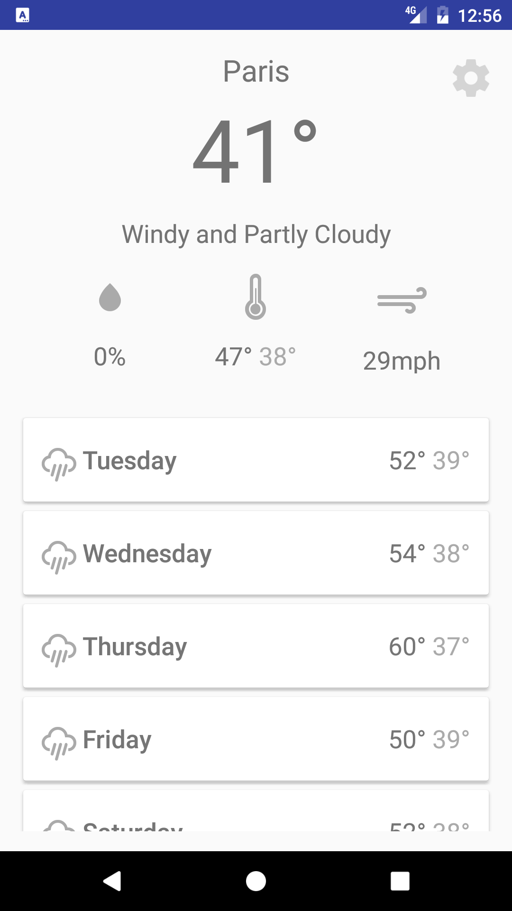
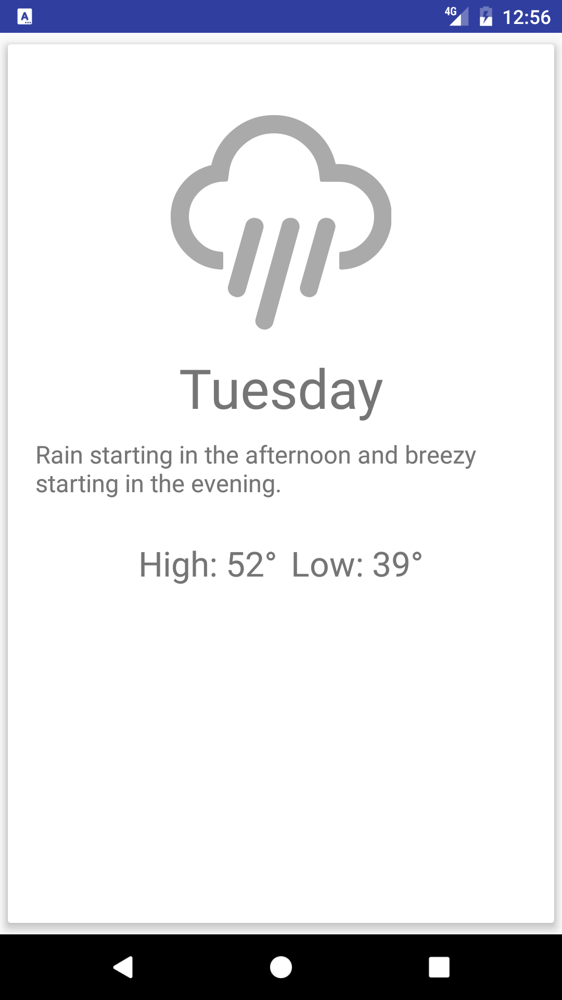

### Weather Time (Android)

This project is a first attempt at learning Android.
It uses Retrofit for accessing the Darksky API.
RecyclerView is being used for the weekly forecast and CardView for the detail view.
The PreferenceFragment is being used for a settings page that allows the user to change their location later on.
Any constructive criticise regarding the use of Android or Java is welcome.


#### Setup
In order to make the project function properly, you must add a secrets.xml file within res/values.
Then simply add the following.

````xmlw
<string name="dark_sky_api">Your Darksky API Key</string>
````

#### What's missing?
- No tests have been implemented yet.
- Weather data does not refresh on a regular basis.
- ~~ConstraintLayout doesn't work with Landscape mode.~~
- ~~Does not use ConstraintLayout yet. It may look odd on some devices.~~


#### Screenshots
Forecast Master Fragment             |  Forecast Detail Fragment
:-------------------------:|:-------------------------:
 | 


